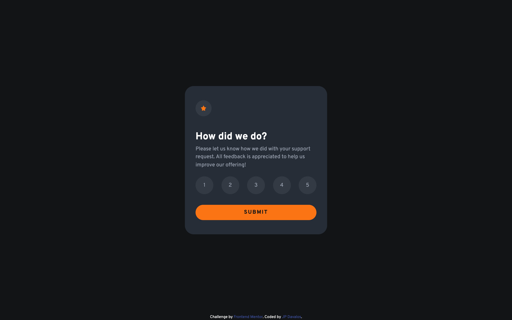

# Frontend Mentor - Interactive rating component solution

This is a solution to the [Interactive rating component challenge on Frontend Mentor](https://www.frontendmentor.io/challenges/interactive-rating-component-koxpeBUmI). Frontend Mentor challenges help you improve your coding skills by building realistic projects.

## Table of contents

- [Overview](#overview)
  - [The challenge](#the-challenge)
  - [Screenshot](#screenshot)
  - [Links](#links)
- [My process](#my-process)
  - [Built with](#built-with)
  - [What I learned](#what-i-learned)
  - [Continued development](#continued-development)
- [Author](#author)

**Note: Delete this note and update the table of contents based on what sections you keep.**

## Overview

### The challenge

Users should be able to:

- View the optimal layout for the app depending on their device's screen size
- See hover states for all interactive elements on the page
- Select and submit a number rating
- See the "Thank you" card state after submitting a rating

### Screenshot

#### Desktop View



#### Mobile View


### Links

- Solution URL: [Click here](https://www.frontendmentor.io/solutions/interactive-rating-component-with-html-css-and-js-8zAKUpvHg8)
- Live Site URL: [Click here](https://jpdavalos423.github.io/interactive-rating-component/)

## My process

### Built with

- Semantic HTML5 markup
- CSS custom properties
- Flexbox
- Mobile-first workflow

### What I learned

This project included a lot firsts for me. This was the first project from
Frontend Mentor in which I practiced using forms in HTML. Not only that, but
I learned how to access values from these forms in a JavaScript function
and manipulate the contents of the page. I have been practicing mobile-first
workflow and am finding it to be much easier than starting with the desktop
layout. And finally, this was the first project in which I used JavaScript and
I look forward to getting more comfortable with the workflow.

```html
<form id="rating-form" class="rating-card">
  <div class="rating-choices">
    <input type="radio" name="options" value="1" id="choice-1" />
    <label class="choice-label" for="choice-1">1</label>
    <input type="radio" name="options" value="2" id="choice-2" />
    <label class="choice-label" for="choice-2">2</label>
    <input type="radio" name="options" value="3" id="choice-3" />
    <label class="choice-label" for="choice-3">3</label>
    <input type="radio" name="options" value="4" id="choice-4" />
    <label class="choice-label" for="choice-4">4</label>
    <input type="radio" name="options" value="5" id="choice-5" />
    <label class="choice-label" for="choice-5">5</label>
  </div>
  <button type="submit">SUBMIT</button>
</form>
```

```css
@media (min-width: 768px) {
  .thank-you-card-wrapper,
  .rating-card-wrapper {
    padding: 4rem 3rem;
    border-radius: 2.5rem;
  }

  header img {
    margin-bottom: 1rem;
  }

  .rating-card button {
    margin-top: 1rem;
  }

  .rating-choices label {
    padding: 1.2rem;
    width: 5rem;
    height: 5rem;
  }

  .thank-you-card-wrapper span:not(#rating) {
    padding: 0.3rem 1.5rem;
  }
}
```

```js
ratingForm.addEventListener("submit", (event) => {
  event.preventDefault();

  const rating = parseInt(event.target.options.value);
  ratingFeedback.innerHTML = rating;

  ratingCard.style.display = "none";
  thanksCard.classList.remove("hidden");
});
```

### Continued development

What I was unable to figure out was the vertical text spcaing inside by buttons
and labels. I found them to be slightly offset and I couldn't find any information
to help with this issue.

## Author

- Frontend Mentor - [@jpdavalos423](https://www.frontendmentor.io/profile/jpdavalos423)
- GitHub - [@jpdavalos423](https://github.com/jpdavalos423)
